# wakatimeReadmeStats
<div align="center">
  
  
  
</div>

## What is wakatimeReadmeStats?

`wakatimeReadmeStats` lets you showcase beautiful, customizable WakaTime coding activity cards in your GitHub README.  
It pulls your latest WakaTime data and renders it as rich SVG charts you can embed directly using GitHub Actions or a live endpoint URL.

## Table of Contents

- [Quick Setup](#quick-setup)
- [How to Format Your URL](#how-to-format-your-wakatime-stats-url)
- [Troubleshooting](#-troubleshooting)
- [Themes](#themes)
- [Component Types](#component-types)
- [Chart Types](#chart-types)
- [All Shared Parameters](#all-shared-parameters)
- [All Component-Specific Parameters](#all-component-specific-parameters)

## Quick Setup

1. **Create a WakaTime Account**  
   - Sign up at [wakatime.com/signup](https://wakatime.com/signup)  
   - Connect it to your IDE: [Editor Setup Guide](https://wakatime.com/plugins)

2. **Get your API Key**  
   - Copy from [your WakaTime account settings](https://wakatime.com/settings/account)  
   - **Note:** You don't need to share this key for URL-based setup

3. **Add the Stats Card to your README**

```md

```


## How to Format Your WakaTime Stats URL

When using the `wakatimeReadmeStats` service directly via a URL (e.g. with `` in your README), the format of the URL parameters follows a clear structure:

### Essential URL & Parameter
```
https://wakatime-readme-stats.vercel.app/api/wakatimeStats?username=your_wakatime_username
```

### Quick Example
```md

```

### Full Example (Multiple Components + Styling + Scaling)

```md

```

## ❓ Troubleshooting

- No output? Make sure your WakaTime profile is **public**
- URL broken? Check your `username` and `WAKATIME_API_KEY`
- Not updating? Append `?v=1` to the image URL

## Optional for Customization

### Themes

<div align="center">
  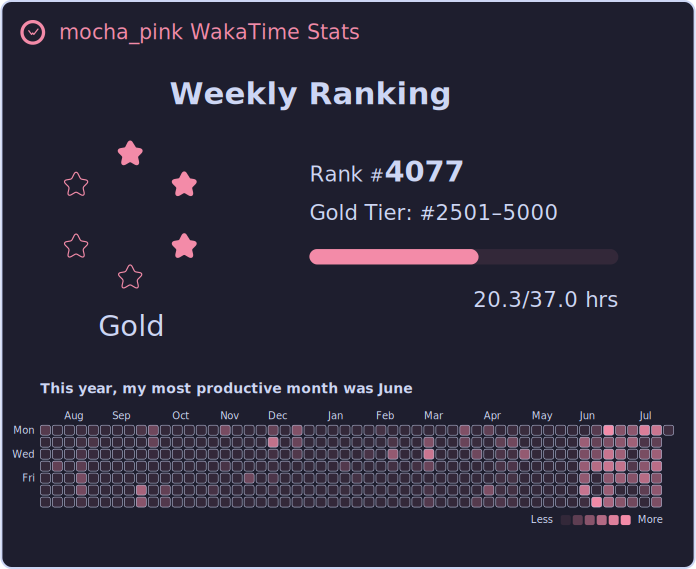
  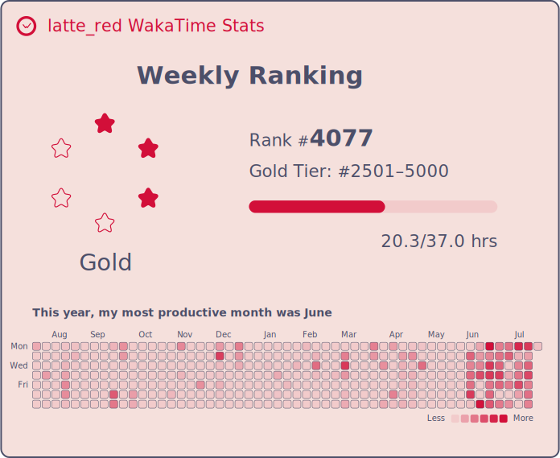
  
</div>

<div align="center">
  
  
  
</div>

<div align="center">
  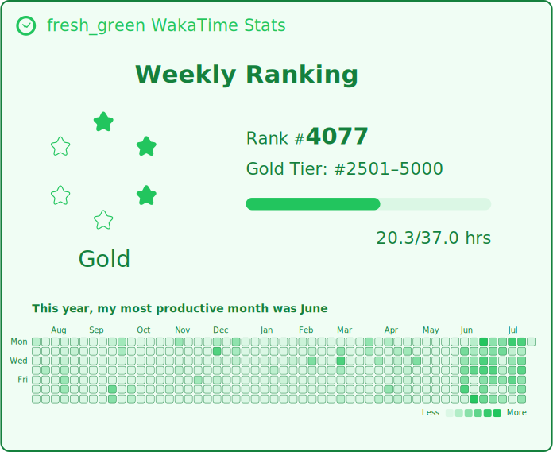
  
  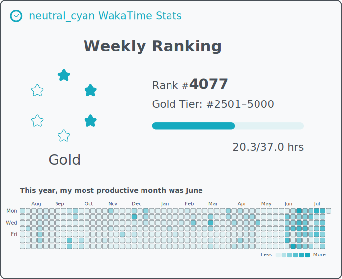
</div>

<div align="center">
  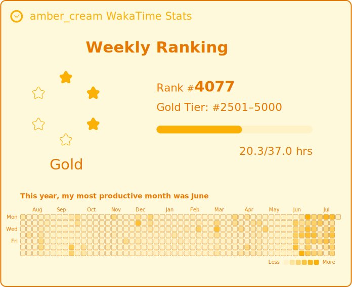
  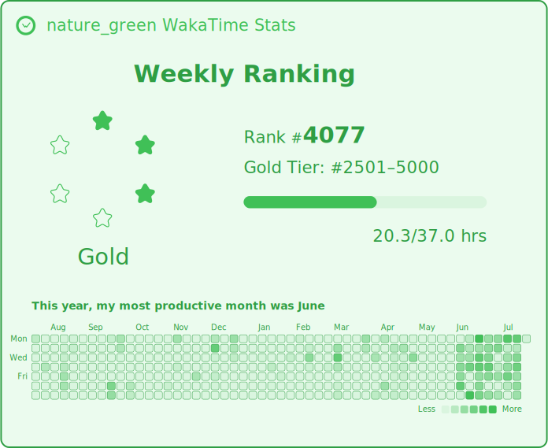
  
</div>

<div align="center">
  
  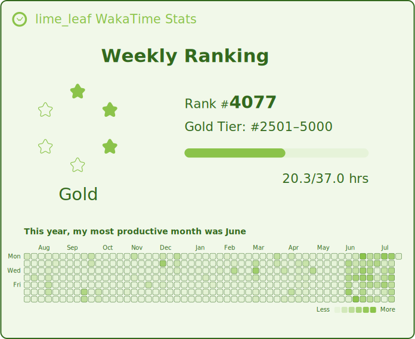
  
</div>

<div align="center">
  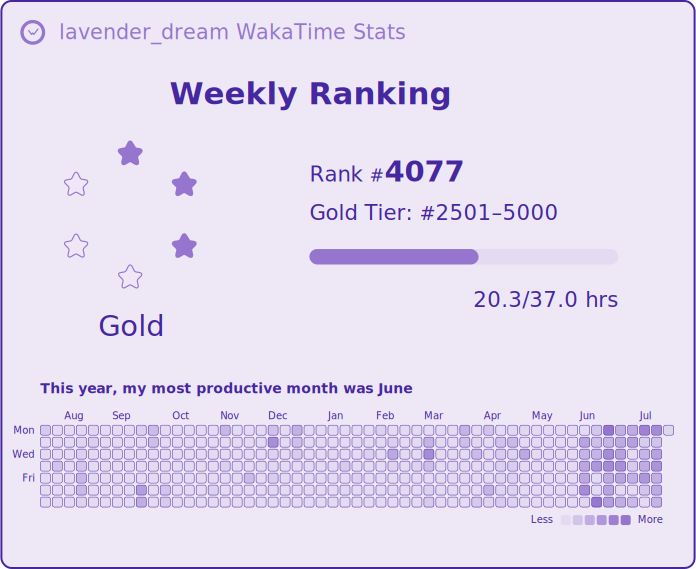
  
  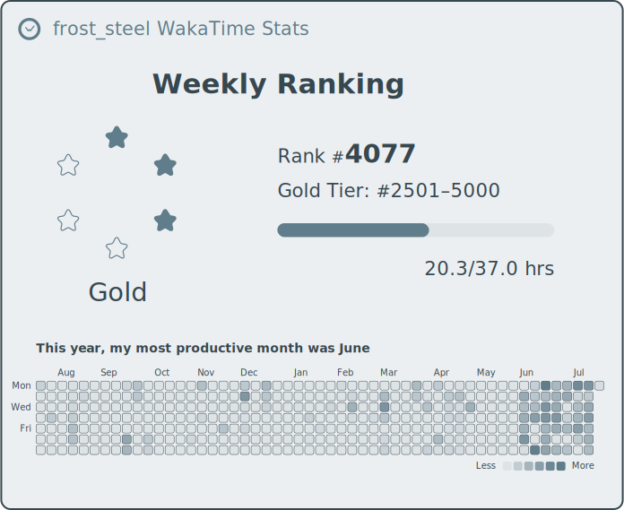
</div>

<div align="center">
  
  
  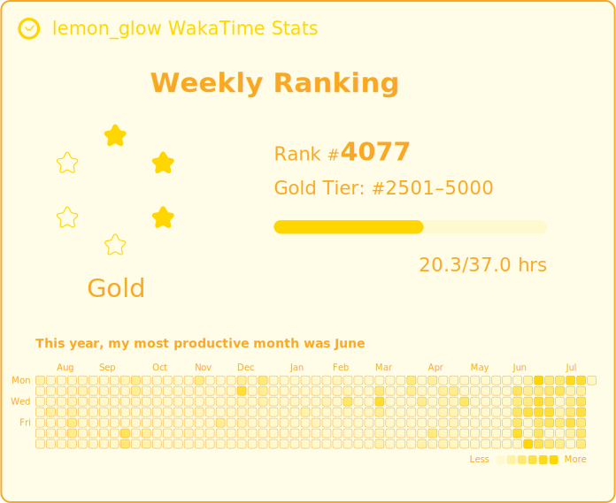
</div>

<div align="center">
  
  
  
</div>

<div align="center">
  
  
  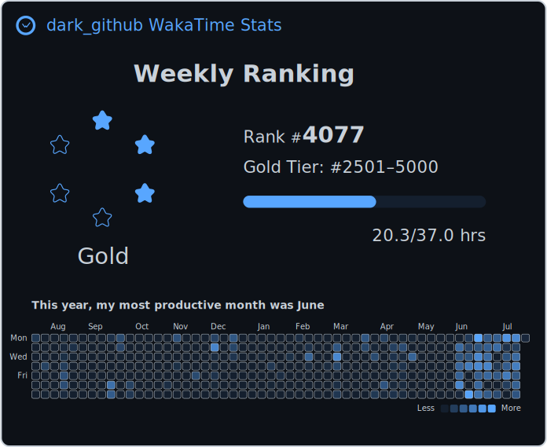
</div>

<div align="center">
  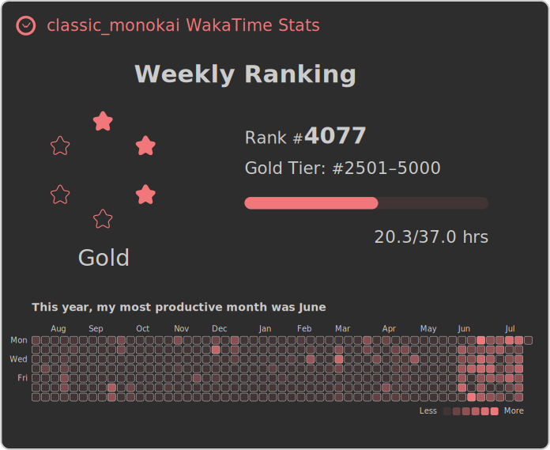
  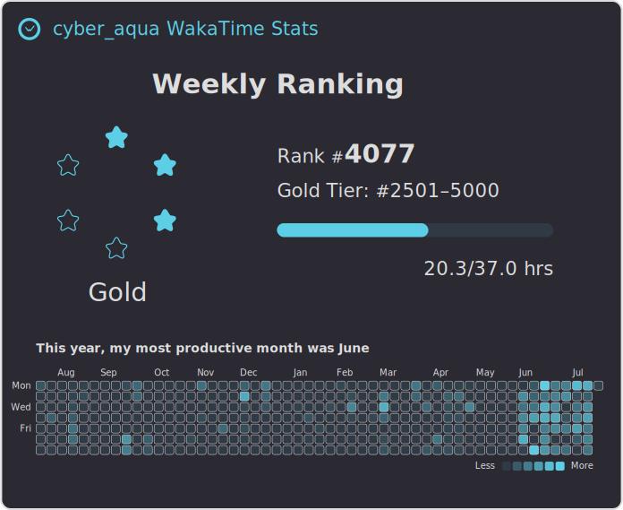
  
</div>

### Component Types

<div align="center">
  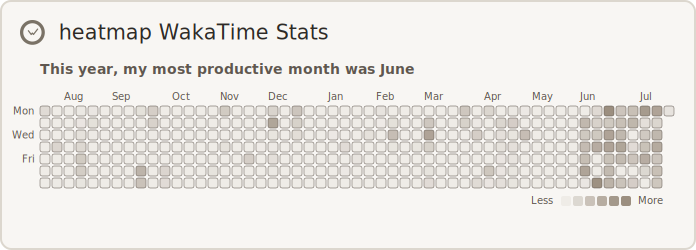
  
</div>

<div align="center">
  
  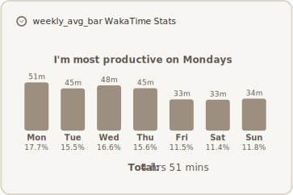
  
</div>

<div align="center">
  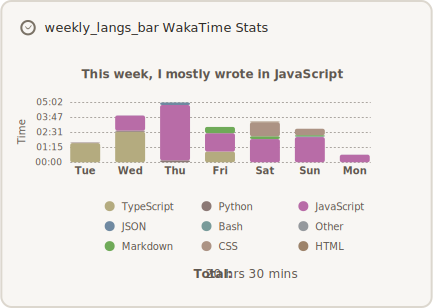
  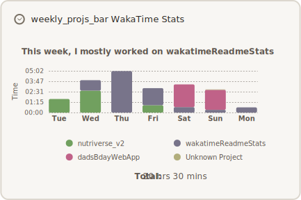
  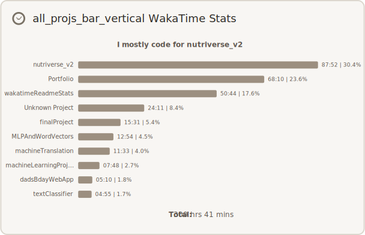
</div>

<div align="center">
  
  
</div>

### Chart Types

<div align="center">
  
  
  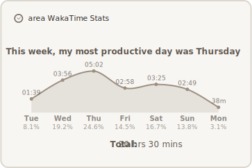
</div>

<div align="center">
  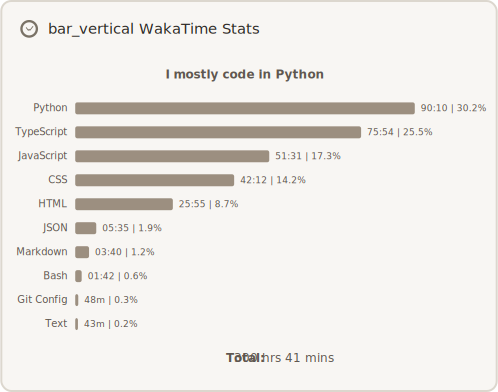
  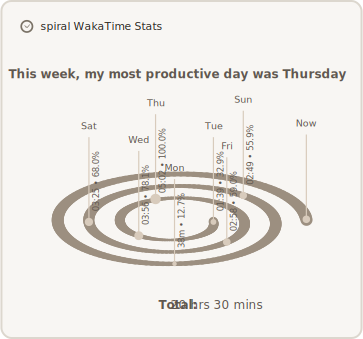
  
</div>

<div align="center">
  
  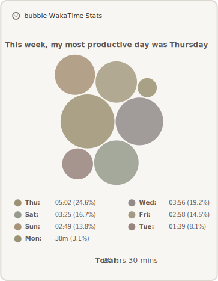
</div>


<details>
<summary>Click to expand full customization parameter list</summary>
  
### All Shared Parameters

| **Parameter**            | **Components**         | **Value**            | **Description**                                                                 | **Example**                         |
|--------------------------|------------------------|----------------------|---------------------------------------------------------------------------------|-------------------------------------|
| `username`               | All                    | `string`             | **Required**. Your WakaTime username (from your WakaTime profile URL).          | `username=yourname`               |
| `theme`                  | All                    | `string`             | Color theme for all card colors.                                                | `theme=teal_neon`                 |
| `bg_color`               | All                    | hex color            | Background color of the SVG card.                                               | `bg_color=ffffff`                 |
| `title_color`            | All                    | hex color            | Color of the title text.                                                        | `title_color=000000`              |
| `text_color`             | All                    | hex color            | Color of all other text.                                                        | `text_color=333333`               |
| `logo_color`             | All                    | hex color            | Color used to fill the WakaTime logo.                                           | `logo_color=a68b2c`               |
| `font_family`            | All                    | string               | Font used across the card.                                                      | `font_family=Fira Code`           |
| `border_color`           | All                    | hex color            | Color of the outer border.                                                      | `border_color=cccccc`             |
| `border_width`           | All                    | number (px)          | Border thickness in pixels.                                                     | `border_width=2`                  |
| `border_radius`          | All                    | number (px)          | Rounded border radius.                                                          | `border_radius=10`                |
| `show_logo`              | All                    | `true` / `false`     | Whether to show the WakaTime logo.                                              | `show_logo=true`                  |
| `title_prefix`           | All                    | string               | Prefix text for the title.                                                      | `title_prefix=My`                 |
| `title_scale_value`      | All                    | decimal              | Scales the title block width (relative to the widest component).                | `title_scale_value=0.8`           |
| `scale`                  | All                    | `true` / `false`     | Whether to auto-scale all components to the same width.                         | `scale=true`                      |
| `componentX_scale_value` | All                    | decimal              | Per-component width scale relative to the widest one. Overrides `scale`.        | `component1_scale_value=1.5`      |

### All Component-Specific Parameters

| **Parameter**            | **Components**                          | **Value**                     | **Description**                                                                 | **Example**                          |
|--------------------------|-----------------------------------------|-------------------------------|---------------------------------------------------------------------------------|--------------------------------------|
| `type`                   | All                 | `basic`, `heatmap`, `rank`, `spedometer`, `weekly`, `weekly_avg`, `weekly_langs`, `weekly_projs`, `all_langs`, `all_projs`      | Specifies which card to render.                                                | `component1_type=weekly_avg`        |
| `chart_type`             | `weekly`, `weekly_avg`, `weekly_langs`, `weekly_projs`, `all_langs`, `all_projs` | `bar`, `bar_vertical`, `line`, `area`, `radar`, `bubble`, `donut`, `spiral` → See notes below for compatibility.  | Chart visualization style.                                          | `component1_chart_type=radar`       |
| `chart_color`            | Same as above                          | hex color                     | Color of bars/lines in charts.                                                 | `component1_chart_color=fcf9f2`      |
| `chart_curved_line`      | Same as above                          | `true` / `false`              | Enables curved line chart if applicable.                                       | `component1_chart_curved_line=true`  |
| `start_day`              | `heatmap`, `weekly`, `weekly_projs`, `weekly_langs` | `mo`, `-7`, etc.              | Starting point for data in charts.                                             | `component1_start_day=-7`           |
| `heading_type`           | `heatmap`, `weekly`, `weekly_avg`, `weekly_langs`, `weekly_projs`, `all_langs`, `all_projs`                    | `friendly`, `compact`         | Title formatting style.                                                        | `component2_heading_type=compact`    |
| `hide_title`             | All                                     | `true` / `false`              | Hides the component title.                                                     | `component3_hide_title=true`        |
| `hide_total`, `hide_time`, `hide_percentage`, `hide_legend` | Most charts                   | `true` / `false`                          | Optionally hide stats within chart.                                | `component2_hide_legend=true`       |
| `y_axis`, `y_axis_label` | Most bar charts                        | `true` / `false`              | Controls Y-axis visibility and label.                                          | `component1_y_axis=true`            |
| `num_langs`, `num_projs` | `all_langs`, `all_projs`               | integer                        | How many top items to show.                                                    | `component2_num_langs=5`            |
| `heatmap_color`          | `heatmap`                              | hex color                     | Color of the heatmap blocks.                                                   | `component3_heatmap_color=fcf9f2`    |
| `rank_color`             | `rank`                                 | hex color                     | Color of the rank highlight.                                                   | `component2_rank_color=ffcc00`       |
| `difficulty`             | `spedometer`                           | `self`, `easy`, `medium`, `hard`      | Difficulty range for spedometer gauge.                                         | `component1_difficulty=medium`       |
| `label_type`             | `spedometer`                           | `standard`, `emoji`, `game`, `emojiStandard`, `emojiGame`, `customEmoji`, `customEmojiStandard`, `customEmojiGame`           | How labels are shown above the gauge.                                          | `component1_label_type=emojiGame`        |
| `custom_emojis`          | `spedometer`                           | 5 emojis string                  | Used when label_type includes customEmoji variations.                                 | `component1_custom_emojis=🐢🐇🚀🔥👑`    |
| `show_high_score`        | `spedometer`                           | `true` / `false`              | Whether to show your highest speed value.                                      | `component1_show_high_score=true`    |

🧾 Notes on chart_type compatibility:
- bar: in all chart components
- radar: only in weekly_avg and weekly
- line, area: not in all_langs, all_projs
- bar_vertical: only in all_langs, all_projs
- bubble, donut: not in weekly_langs, weekly_projs
- spiral: only in weekly, weekly_avg
</details>
